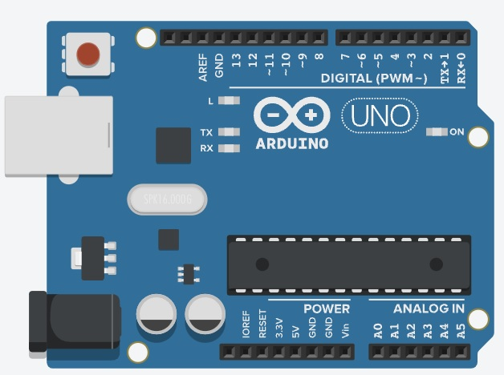

# Projeto Arduíno mais simples

## Contextualização

- Neste experimento faremos com que o LED embutido vinculado ao pino digital 13 (pino digital incorporado LED_BUILTIN = 13) pisque. Este é o experimento  mais simples que se poder fazer com o Arduíno.

## Esquema do projeto

## Projeto no Tinkercad

https://www.tinkercad.com/things/bqfWWQWUI0B